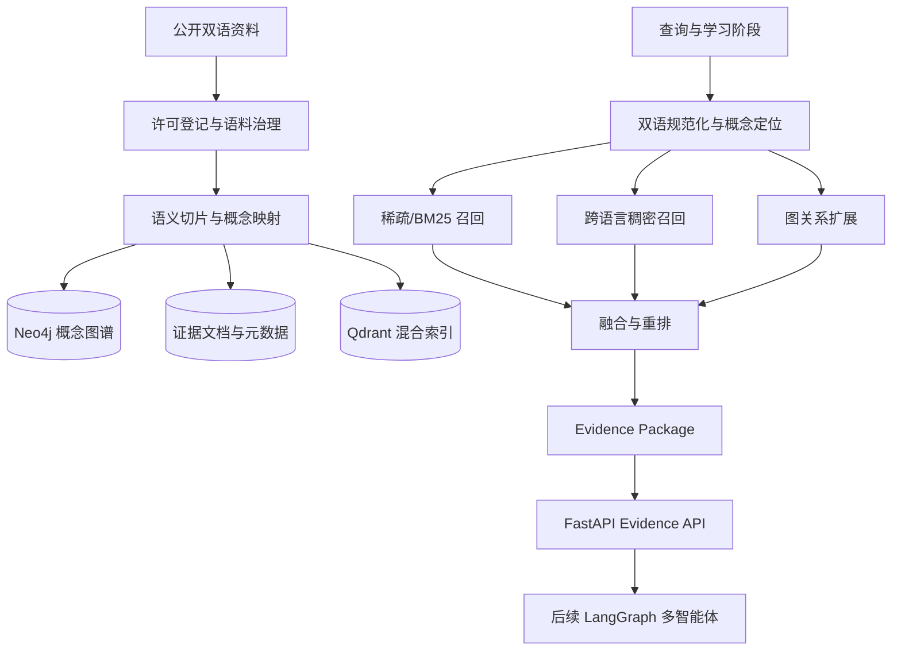

# AI 学习知识库与项目全局设计

- 日期：2026-07-13
- 状态：已确认
- 赛题：XH-202630 领域知识个性化生成与多智能体协同决策系统研究
- 作品：面向人工智能领域的知识个性化生成与多智能体协同决策系统
- 总目标：冲击擂主
- 提交截止：2026-09-05

## 1. 项目结论

项目采用“知识库先行、算法研究并行、智能体框架预热”的推进策略。

第一阶段先独立建设面向高校本科生的双语 AI 学习知识库。知识范围从机器学习延伸到大语言模型，智能体开发不作为教学内容。知识库形成稳定的 Evidence API 后，再由 LangChain/LangGraph 多智能体系统消费证据。

核心技术路线为分层混合知识库：

1. 概念图谱层保存知识结构、先修关系和教学关系。
2. 证据文档层保存可追溯的中英文原始材料切片。
3. 混合索引层提供稀疏/BM25、跨语言稠密向量和图关系检索。

LangChain 用于文档与检索组件，LangGraph 用于后续多智能体状态机。框架本身不作为创新点；项目创新应来自知识组织、双语上下文工程、证据约束、算法设计和可复现实验。

## 2. 目标与成功标准

### 2.1 产品目标

建立一个可版本化、可评测、可追溯的 AI 教学证据服务，使后续智能体能够按学习者背景获得：

- 正确且来源明确的概念解释；
- 与当前知识点匹配的先修知识；
- 适合指定难度的公式、代码、案例和练习；
- 中英文一致的术语与证据；
- 可供审核和裁决使用的结构化置信信息。

### 2.2 比赛目标

最终系统仍需满足赛题全流程闭环：

`学情画像 -> 多智能体诊断/生成/审核 -> 个性化资源 -> 交互反馈 -> 动态更新`

满分线目标包括：

- 专业知识谬误率（幻觉率）小于 5%；
- 学习者画像与资源难度适配准确率不低于 85%；
- 核心知识点覆盖率不低于 90%；
- 至少 3 类差异化学习者画像；
- 采用 60 组完整测试用例，超过“不少于 50 组”的评分门槛；
- 提交可部署系统、源码、单元测试、部署说明、测试数据、项目书、PPT 和 10 分钟内演示视频。

### 2.3 知识库 v1 验收目标

- 120–180 个核心概念节点；
- 800–1,200 个审核后的证据切片（中英文合计）；
- 60–90 个例题、代码示例和练习；
- 150 条以上人工标注检索问题；
- Recall@5 不低于 0.85；
- MRR@10 不低于 0.75；
- nDCG@10 不低于 0.80；
- 核心知识覆盖率不低于 90%；
- 中英文召回指标差距不超过 5 个百分点；
- 本地 P95 检索延迟小于 2 秒；
- 来源与许可登记完整率 100%；
- 引用可重新定位率不低于 98%；
- 近重复切片比例低于 2%。

## 3. 范围与非目标

### 3.1 全局知识范围

知识地图覆盖：

1. 经典机器学习；
2. 深度学习；
3. Transformer；
4. 大语言模型。

### 3.2 三个深做模块

1. 经典机器学习：监督学习框架、逻辑回归、损失与优化、模型评价和过拟合；
2. Transformer：注意力机制、位置编码、多头注意力、编码器与解码器；
3. 大语言模型：预训练、对齐、参数高效微调、推理与评测、RAG 应用实训。

深度学习其余内容只铺设全局知识图，包括神经网络、反向传播、优化、正则化、CNN、RNN 和表示学习。

### 3.3 明确排除

- 不把智能体开发纳入课程教学内容；
- v1 不完整覆盖所有机器学习和深度学习算法；
- 不整本录入版权不明确的商业教材；
- 不把论坛回答、营销文章或 LLM 自动生成内容作为正式证据；
- 第一阶段不设计复杂的智能体内部算法；
- 不让 LangGraph 介入确定性的离线采集和建库流水线。

## 4. 总体架构

### 4.1 数据职责

- PostgreSQL：来源登记、许可状态、版本、审核状态、评测集和运行记录；
- Qdrant：中英文稠密向量、稀疏/BM25 表示、元数据过滤和混合召回；
- Neo4j：概念、先修、组成、对比、易混淆和教学关系；
- 文件目录或 MinIO：保存允许存储的原始公开文档与解析中间件；
- FastAPI：对外提供稳定的 Evidence API；
- LangChain：Loader、Splitter、Retriever、Runnable、工具与结构化 Schema；
- LangGraph：后续 Agent State、节点、条件路由、重试、检查点和人工介入。

## 5. 知识模型

### 5.1 核心实体

| 实体 | 用途 |
| --- | --- |
| Concept | 定义、符号、先修、难度、中英文名称与别名 |
| Method | 算法步骤、适用条件、复杂度、局限与比较对象 |
| Skill | 推导、实现、调参、分析或评价等能力目标 |
| Evidence | 原始切片、公式、图表、代码与精确引用 |
| Source | 作者、机构、URL、许可、版本、发布日期与权威等级 |
| Term | 中英文规范名、缩写、别名和语境相关译法 |
| Example | 直观例子、数值例题、代码演示和真实案例 |
| Exercise | 题型、目标能力、难度、答案、解析与评分要点 |
| Misconception | 常见错误、错误成因、反例和纠正解释 |

### 5.2 核心关系

- `PREREQUISITE_OF`：先修关系；
- `PART_OF`：组成关系；
- `EXPLAINS`：证据解释概念；
- `DEMONSTRATES`：示例展示概念或方法；
- `ASSESSES`：练习测量能力；
- `CONFUSED_WITH`：易混淆关系；
- `CONTRASTS_WITH`：对比关系；
- `CITED_FROM`：来源追溯关系。

### 5.3 证据切片最小字段

每个正式切片必须包含：

- `chunk_id`、`concept_ids`、内容哈希；
- `language` 和术语对齐版本；
- 内容类型：定义、推导、代码、案例或练习；
- 来源 URL、标题、作者、机构和许可；
- 章节、页码、段落或网页锚点；
- 发布日期、抓取时间和有效状态；
- 难度、前置知识、目标能力和适用年级；
- 权威等级、完整性检查和审核状态。

## 6. 双语与语料治理

### 6.1 双语策略

中英文各占同等重要地位，但不按原始切片数量机械凑 1:1。

每个核心概念至少绑定一条可靠中文证据和一条可靠英文证据。英文优先承担原始论文、官方定义和版本事实；中文优先承担本科生可理解的教学解释。团队翻译或改写必须标记为 `derived`，并保留原始来源，不能冒充原文。

“同等重要”按核心概念的双语证据覆盖衡量，不要求中英文切片总数完全相等。v1 的 800–1,200 个切片是两种语言的合计数量。

### 6.2 来源分级

- S1 核心证据：原始论文、权威综述、标准、技术报告、模型卡和官方文档；
- S2 教学解释：明确开放许可的教材、高校开放课程讲义、官方教程和示例代码；
- S3 补充参考：机构技术博客、高质量社区教程、公开演讲和访谈。

关键定义和结论必须至少有 S1 证据。S3 不得单独支撑关键结论。

### 6.3 生命周期

`Candidate -> Licensed -> Parsed -> Auto-checked -> Human-reviewed -> Published -> Deprecated`

许可核验是硬门禁。不能全文使用的材料只保存必要元数据和引用，不保存未经授权的全文。

所有正式发布切片均需人工复核。专业内容和双语术语分别检查。过期材料进入 `Deprecated`，不静默覆盖，以便追溯知识版本演进。

## 7. 建库流水线

1. 来源登记：记录 URL、作者、机构、语言、版本、许可和候选用途；
2. 获取与解析：提取正文、标题、代码、公式、表格和定位信息；
3. 清洗与去重：移除导航噪声，执行精确和近重复检测；
4. 双语术语对齐：映射统一概念 ID、规范名、缩写和别名；
5. 语义切片：按定义、推导、示例、代码和练习分块，不截断必要条件；
6. 自动检查：语言、结构、链接、哈希、格式、版本和引用完整性；
7. 人工复核：专业正确性、语义完整性、教学适用性和双语一致性；
8. 发布索引：写入 PostgreSQL、Qdrant 和 Neo4j；
9. 构建报告：输出数量、覆盖、重复、失败和版本差异。

流水线必须可重复运行。同一输入和同一配置应产生可解释的版本结果，不能依赖人工复制粘贴完成正式建库。

## 8. 检索与 Evidence API

### 8.1 查询流程

1. 接收问题、语言、目标概念、学习阶段、难度和版本约束；
2. 进行术语消歧、别名展开和中英文查询变体生成；
3. 定位概念候选及必要先修知识；
4. 并行执行稀疏/BM25、跨语言稠密向量和图关系扩展；
5. 使用 RRF 融合候选；
6. 按相关性、来源权威度、难度、时效、多样性和版本重排；
7. 返回结构化证据包。

图扩展默认 1 跳，最多 2 跳，只允许配置的关系类型参与扩展。

### 8.2 证据包契约

Evidence Package 至少包含：

- 原始查询和规范化查询；
- 命中的概念及概念关系；
- 证据正文和内容类型；
- 来源、引用定位、许可与版本；
- 稀疏、稠密、图扩展和最终重排分数；
- 语言、难度和权威等级；
- `conflict`、`deprecated`、`coverage_gap` 等风险标记。

知识库组不为每个智能体编写专用检索逻辑。所有消费者通过同一 Evidence API 和版本化契约访问知识。

## 9. 失败与降级

- 无有效召回：放宽非关键过滤并扩展双语查询；仍失败则返回 `coverage_gap`，不生成虚假证据；
- 证据冲突：保留双方来源并标记 `conflict`，交由后续审核智能体或人工裁决；
- 版本过期：旧证据降权但不删除，优先返回替代版本并保留演进关系；
- 图扩展噪声：限制关系白名单、跳数和候选数量；图通道失败不阻断文本检索；
- 单一存储故障：文本混合检索是最低可用路径，图数据库可降级；
- 引用无法定位：证据不得进入正式结果；
- 建库中断：按来源和批次记录状态，可从上一个成功批次恢复。

## 10. 评测与实验

### 10.1 评测集

建立不少于 150 条人工标注检索问题，按以下维度分层：

- 语言：中文、英文、中英混合；
- 模块：经典机器学习、深度学习概览、Transformer、大语言模型；
- 类型：定义、推导、比较、代码、案例、易错点；
- 难度：基础、理解、应用、分析；
- 标注：相关概念、必要证据、可接受证据和无关证据。

评测问题与知识库切片分离管理。禁止使用同一批自动生成内容同时充当语料和测试答案。

### 10.2 消融实验

必须完成：

1. BM25 only；
2. Dense only；
3. BM25 + Dense；
4. Hybrid + Graph；
5. Hybrid + Graph + Rerank。

实验报告同时给出总体指标、语言分组、模块分组、问题类型分组和典型错误案例。指标不达标时先进行错误分层，再调整切片、查询或重排，不盲目增加语料。

## 11. 后续智能体集成边界

智能体系统使用 Python 版 LangChain 与 LangGraph。

知识库阶段仅预先定义接口，不提前实现复杂内部算法。LangGraph 第一版只建立：

- Agent State Schema；
- 诊断、检索、生成、审核和裁决节点接口；
- 条件路由、重试次数和退出条件；
- Checkpoint、运行日志和事件流；
- Evidence API 适配；
- 人工中断与恢复接口。

后续最小闭环至少包含诊断、生成和审核 3 个智能体。复杂辩论、学情算法和协同决策算法必须在算法组给出 Algorithm Spec 与实验依据后再接入。

## 12. 团队分工

六名稳定成员采用 2 + 2 + 2 分组。

### 12.1 知识库组：2 人

- KB-1 知识模型与语料治理：Ontology、概念关系、双语术语、来源白名单、许可登记、审核规则和 Neo4j；
- KB-2 数据与检索工程：LangChain Loader/Splitter、解析去重、Qdrant、融合重排、PostgreSQL 和 Evidence API。

共同交付：可重复建库流水线、双语知识资产、稳定 Evidence API 和覆盖/检索报告。

### 12.2 算法组：2 人

- ALG-1 文献与算法方案：持续检索论文，建立研究矩阵，提出检索、学情匹配、审核和协同决策的候选算法；
- ALG-2 原型与实验验证：将候选方法转成最小原型，设计基线、指标、消融和错误分析。

共同交付：每周研究简报、算法候选卡、Algorithm Spec、可复现实验和量化结论。论文链接或文献综述本身不算完成。

### 12.3 智能体组：2 人

- AG-1 LangGraph 编排与后端：State、节点、边、条件路由、检查点、重试、降级、FastAPI 和日志；
- AG-2 Agent 契约与交互：工具 Schema、结构化输出、上下文工程、提示模板、证据引用、多轮反馈和前端事件流。

共同交付：可运行状态机、最小多智能体闭环、完整调用轨迹和异常/人工介入路径。

### 12.4 其余 3 名阶段参与成员

- S1 双语语料与人工审核：来源登记、术语对齐和切片复核；
- S2 标注、画像与系统测试：150 条以上检索题、至少 3 类画像和 60 组系统测试；
- S3 前端与竞赛材料：状态可视化、图谱展示、项目书、PPT、视频和提交清单。

### 12.5 跨组契约

- `Evidence API` 由知识库组负责；
- `Algorithm Spec` 由算法组负责；
- `Agent State` 由智能体组负责。

跨组需求先修改版本化契约再改实现。智能体不得绕过 Evidence API 直接访问知识库底层存储。

检索相关工作的边界如下：算法组负责论文调研、候选方法、基线、指标、原型和消融结论；知识库组负责将通过评审的方案工程化为稳定检索服务，并维护数据、索引和 Evidence API。

## 13. 总排期

| 日期 | 阶段 | 关键产出 | 硬门禁 |
| --- | --- | --- | --- |
| 07/13–07/16 | P0 设计冻结 | 仓库、环境、Schema、来源政策、任务看板、首批来源 | 方案可执行 |
| 07/17–07/27 | P1 知识库 Pilot | 30–50 概念、200–300 切片、三个深做模块端到端样例 | 可查询证据包 |
| 07/28–08/07 | P2 扩容与检索 | 120–180 概念、800–1,200 切片、混合检索、评测集 v1 | KB v1 冻结 |
| 07/28 起并行 | LangGraph 骨架 | State、节点接口、日志、Mock/Evidence API 适配 | 不进入复杂算法 |
| 08/08–08/17 | P3 检索优化 + Agent v1 | 消融实验、真实证据接入、诊断/生成/审核闭环 | 闭环真实运行 |
| 08/18–08/27 | P4 系统集成 | 反馈、前端、3 类画像、60 组测试、故障验证 | 功能冻结 |
| 08/28–09/01 | P5 发布候选 | 部署、录屏、项目书、PPT、报告、源码和数据 | RC 可提交 |
| 09/02–09/05 | P6 缓冲与提交 | 只修阻断问题，最终打包、校验和上传 | 09/05 前提交 |

范围纪律：

- 08/07 后不扩展知识主题；
- 08/17 后不增加 Agent 角色；
- 08/27 后不增加产品功能。

## 14. 项目治理与完成定义

### 14.1 协作规则

- 每项任务只有一名直接负责人；
- 数据、代码和文档进入同一版本库；
- 核心模块至少一人交叉复核；
- 每周检查可运行产物、指标和风险，不以口头进度替代验收；
- 三组按照版本化契约并行工作；
- 所有实验记录配置、数据版本、随机种子、指标和失败案例。

### 14.2 知识库 v1 完成定义

只有同时满足以下条件才算完成：

1. 建库流水线可从已登记来源重复执行；
2. 数据规模和双语覆盖达到目标；
3. 每条正式证据均通过许可和人工质量门禁；
4. Evidence API Schema 固定并有契约测试；
5. 三路检索、重排和降级路径可独立测试；
6. 离线指标达到验收线；
7. 消融实验与错误分析完成；
8. 部署、重建、评测和数据字典文档齐全。

## 15. 主要风险与预案

| 风险 | 预案 |
| --- | --- |
| 语料进度落后 | 优先三个深做模块；全局模块只保留概念图和核心证据 |
| 中英文资料不平衡 | 用带来源的人工派生解释补齐，并明确标记 `derived` |
| 检索指标不达标 | 先做错误分层，再调整切片、查询扩展、Embedding 或重排 |
| Neo4j 集成阻塞 | 保持文本检索独立，图通道降级不阻断 Evidence API |
| 算法研究无落地 | 每项候选算法必须有输入输出、基线、原型和实验结果 |
| Agent 集成延期 | 收敛为诊断、生成、审核 3 Agent 最小闭环 |
| 材料制作挤压研发 | S3 从 P2 开始同步积累截图、指标、架构和运行证据 |

## 16. 已确认决策清单

- 目标档位：冲击擂主；
- 稳定投入：5–6 人，其他成员阶段参与；
- 教学对象：高校本科生；
- 教学范围：机器学习到大语言模型，不教授智能体开发；
- 大语言模型模块：原理与应用结合；
- 优先顺序：先创建知识库，再实现智能体内部逻辑；
- 语料来源：权威公开资料；
- 语言策略：中英文同等重要；
- 知识库路线：分层混合知识库；
- 技术后端：Python；
- 框架：LangChain + LangGraph；
- 存储：PostgreSQL + Qdrant + Neo4j；
- 分工：2 人知识库、2 人算法、2 人智能体，其余 3 人阶段支持。
