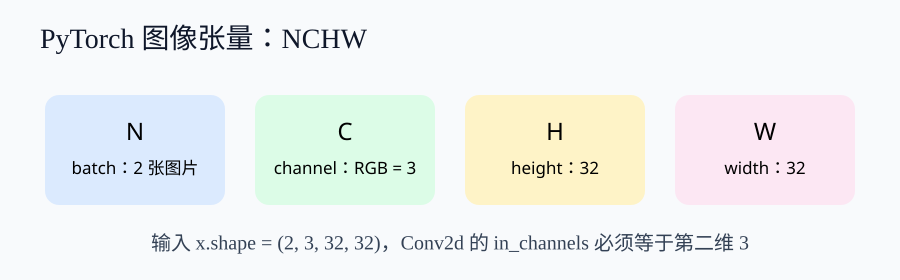
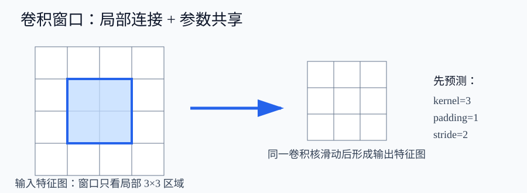
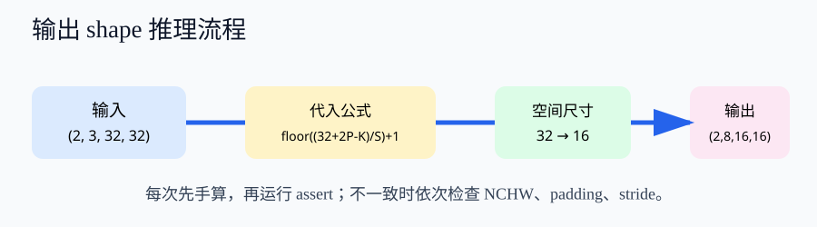

# 卷积神经网络（CNN）：卷积运算学习讲义

## 你将解决的真实问题

给一张 32×32 的 RGB 图片，为什么一个小小的 3×3 窗口能提取有用特征？为什么 stride 从 1 改成 2，输出会从 32×32 变成 16×16？本讲义不要求你背定义，而要求你能先预测、再计算、最后用代码验证。

## 本次学习边界

当前学习深度为 **intro**：先把图像张量、卷积窗口、padding、stride 与Conv2d 的联系建立起来。完整 CNN 训练、BatchNorm 和更复杂架构会在后续先修解锁后单独进入，不在这一节混讲。

推荐学习顺序：概念直觉理解 → 数学推导 → 代码实战 → 面试考点。

### 本周两次学习安排

- 第 1 次（50 分钟）：概念直觉与两次尺寸推导；检查：能解释 NCHW、卷积/互相关区别，并手算 32→16。
- 第 2 次（40 分钟）：PyTorch shape 验证与代码纠错；检查：能运行 Conv2d/池化断言并定位 NHWC 错误。

本周可投入 10 小时；当前资源包只占 90 分钟。剩余时间建议：先完成图像张量前置复习与错题复盘；不要在课程规划未解锁前跳到完整 CNN 训练。

## 1. 学习目标与完成标准

- 解释卷积运算的核心含义并识别其基本场景。
- 识别输入图像张量、卷积核、步幅和填充对输出特征图的影响。
- 在 PyTorch 中读取并修改一个基础 nn.Conv2d 示例。

完成标准不是“看懂代码”：你需要能手算一次输出尺寸，解释一个卷积核如何同时处理 RGB 三个通道，并在 PyTorch 中确认每一步的 NCHW shape。

## 2. 先补一块必要前置：图像张量

PyTorch 图像默认使用 NCHW：N 是批次，C 是通道，H、W 是高度与宽度。一批两张 CIFAR-10 彩色图片应写成 (2, 3, 32, 32)，而不是 NHWC。后续 Conv2d 的 in_channels 必须等于 C；这是代码形状错误最常见的根源。

## 3. 为什么图像适合卷积：从 MLP 的参数爆炸开始

若将 32×32×3 图像直接展平并连接到 1000 个隐藏单元，参数量约为 32×32×3×1000 = 3,072,000。一个 3×3、3 输入通道、8 输出通道的卷积层只有 3×3×3×8 + 8 = 224 个参数。卷积依靠两件事减少参数：

- 局部连接：一个输出位置只看输入附近的小窗口；
- 参数共享：同一个卷积核在整张图上滑动，边缘和纹理无论出现在哪里都可复用。

## 4. 卷积、互相关与特征图

把 3×3 卷积核看成一个小检测器。它在输入上滑动，每个位置做逐元素相乘再求和，得到一张输出特征图。严格的数学卷积会翻转卷积核；深度学习框架的 Conv2d 通常计算互相关，但工程里仍习惯称为卷积层。

| 对比项 | 数学卷积 | CNN 常用互相关 |
|---|---|---|
| 卷积核 | 先翻转 | 通常不翻转 |
| 共同点 | 局部窗口、乘加汇聚 | 局部窗口、乘加汇聚 |
| 学习时要点 | 术语与手算要区分 | 代码接口仍叫 Conv2d |

## 5. 输出尺寸：必须逐步计算

本学生的数学支架策略：数学基础可支持推导：保留两道完整尺寸例题与参数量核对，要求写出中间步骤。

单个空间维度的公式为：

~~~text
输出 = floor((输入 + 2×padding - kernel_size) / stride) + 1
~~~

例 1：输入 32、kernel=3、padding=1、stride=1：floor((32+2-3)/1)+1=32，空间尺寸保持不变。

例 2：输入 32、kernel=3、padding=1、stride=2：floor((32+2-3)/2)+1=16，输出为 16×16。这里最容易错的是漏掉两侧填充的 2×padding，或把 stride 当成减法。

## 6. 通道、卷积核与参数量

彩色图片有 3 个输入通道。设置 Conv2d(3, 8, 3) 时，8 表示要学习 8 组卷积核，每一组都覆盖全部 3 个输入通道。因此忽略 bias 的参数量为 3×8×3×3=216；默认启用 8 个 bias，总参数为 224。out_channels 改变的是输出特征图数量，不是特征图的高和宽。

## 7. stride、padding、池化：不要混为一谈

| 操作 | 是否有可学习参数 | 主要作用 | 常见误解 |
|---|---:|---|---|
| Conv2d | 是 | 提取局部特征 | 以为只改变通道 |
| padding | 否 | 控制边界和尺寸 | 忘记公式中的 2P |
| stride | 否 | 控制窗口移动距离 | 忽略对尺寸的下采样 |
| MaxPool2d | 否 | 汇聚局部响应 | 误以为等同卷积 |

## 8. 公式如何映射到 PyTorch

~~~python
nn.Conv2d(
    in_channels=3, out_channels=8,
    kernel_size=3, stride=2, padding=1
)
~~~

调用前先打印 x.shape；调用后先打印 y.shape；再用公式核对 32 是否变成 16。这一顺序对应“概念 → 公式 → 代码 → 验证”，避免只运行、不理解。

## 9. 针对本学习者的防错设计

- 特别注意区分'卷积'与'互相关'操作、区分BatchNorm的training/eval模式，这两个是高频概念混淆点

- 输出尺寸公式必须配至少两个逐步计算示例，突出 padding 和 stride。
- 先解释为什么图像适合局部连接，再引出卷积，禁止直接跳到 ResNet。
- 用对比表区分卷积、互相关、转置卷积和池化。

学习建议：先看讲义第 2–6 节，完成 Notebook 的 shape 断言，再做测验中的计算题；如果连续两题算错，不进入下一节，而是回到第 5 节逐项代入。

## 10. 本轮边界与下一阶段

- 用滑动窗口和局部感受的图示解释卷积直觉。
- 说明输入张量 NCHW、卷积核、输入/输出通道的关系。
- 分步讲解 H_out=floor((H+2P-K)/S)+1，并给出两道完整计算示例。
- 用对比表区分卷积、互相关、转置卷积和池化。
- 只做基础 Conv2d 讲解，不扩展到完整 CNN 架构。
- 使用 Python、PyTorch 和 Jupyter Notebook。
- 从形状为 [B,C,H,W] 的小型图像张量开始，不假定学生会完整训练模型。
- 提供 4 个 worked examples，覆盖 Conv2d、kernel_size、stride、padding 和通道变化。
- 提供 8 个 guided exercises，包含输出尺寸计算、参数修改和错误代码诊断。
- 每段代码必须显示输入/输出 shape，并包含可直接运行的最小示例。
- 生成 8 道题：3 道概念题、3 道输出尺寸计算题、2 道 PyTorch 代码阅读/纠错题。
- 每道题必须给出答案、逐步解析、关联学习目标和错误类型。
- 至少一道题专门检查 padding 翻倍项，至少一道题检查 stride 对尺寸的影响。
- 不得使用 ResNet、迁移学习或高级 CNN 架构作为必答前置。

当图像张量先修完成、正式证据发布且课程规划重新允许时，下一轮可增加特征图可视化、BatchNorm、完整 CNN 训练与 CIFAR-10 项目。

当前项目连接：用 CIFAR-10 的 32×32×3 输入理解卷积 shape；后续连接图像分类与目标检测。

## 候选证据来源

- definition：DeepLearning Chapter 9 Convolutional Networks（dl_ch09_cnn_a3dde521400f，candidate_only）
- definition：DeepLearning Chapter 9 Convolutional Networks（dl_ch09_cnn_5e2a9735ace2，candidate_only）
- code：DeepLearning Chapter 9 Convolutional Networks（dl_ch09_cnn_51551ccb3ced，candidate_only）
- code：Derived PyTorch candidate from DeepLearning Chapter 9 Convolutional Networks（derived_dl_ch09_cnn_pytorch_conv2d_0804，candidate_only）
- exercise：Derived exercise candidate from DeepLearning Chapter 9 Convolutional Networks（derived_dl_ch09_cnn_exercise_0804，candidate_only）

> 资源状态：candidate_draft。这是可学习、可审核的候选草稿；正式教学发布前仍需完成证据审核与课程门禁。
